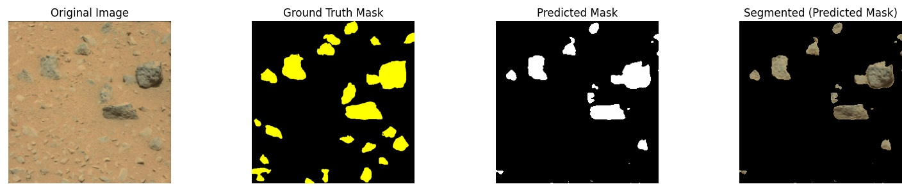
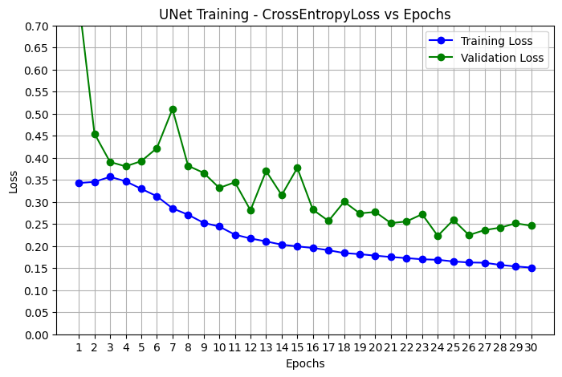

# LunarMUnet
Martian Section(Ready for use)

Mars remains a frontier for exploration and a stepping stone for space exploration. 
Due to the distance from Earth; Martian exploration may initially depend on autonomous operations that may face many hazards such as rocks and craters. We have implemented a U-Net-only image segmentation model for Martian landscape segmentation for rock detection. Rocks remain a major hazard to any autonomous planetary rover. 

1) Clone the repo & open "Final unet_lunar_rocks.ipynb"  Google Collab Notebook.

   i) You will need a Google Gmail & Collab account.
   ii) You will need a Kaggle account as described in "Final unet_lunar_rocks.ipynb" to get the   
   training data. 

   OR

   You can copy the code to your local drive.

3) Code has been tested using Python 3.11 & and it is better you use a virtual environment.
4) Refer to the notebook the "Mars_Unet_Rocks.ipynb" 
  
pip install -r  requirements.txt

4) Follow the directions in "Martian - Image Segmentation using U-Net on Martian Landscape Data Using Pytorch.pdf"

   Sample Loss after 30 epochs using only 10 training images and 180 augmentations:

   

Lunar Section (Code is under development) 
Artificial Lunar Surface Segmentation Using U-Net in PyTorch

Earth’s Moon remains a frontier for exploration and a stepping stone for planetary exploration. Due to lack of atmosphere, distance from Earth’s resources, autonomous operations are a viable solution to build lunar infrastructure. The goal is to determine if U-Net is suitable based on performance metrics such as (Dice an/or IoU). 

1) Clone the repo & open "Final unet_lunar_rocks.ipynb"  Google Collab Notebook.

   i) You will need a Google Gmail & Collab account.
   ii) You will need a Kaggle account as described in "Final unet_lunar_rocks.ipynb" to get the   
   training data. 

   OR

   You can copy the code to your local drive.

3) Code has been tested using Python 3.11 & and it is better you use a virtual environment.
4) Refer to the notebook the "Final unet_lunar_rocks.ipynb" "SECTION 1" or copy the code & locally run:
  
pip install -r  requirements.txt

4) Follow the directions in "Lunar - Image Segmentation using U-Net on Lunar Landscape Data Using Pytorch.pdf"

Lunar Training data was provided as open-source data via Kaggle from Robotics Group of Keio University in Japan (https://www.srg.mech.keio.ac.jp/en/)

      

